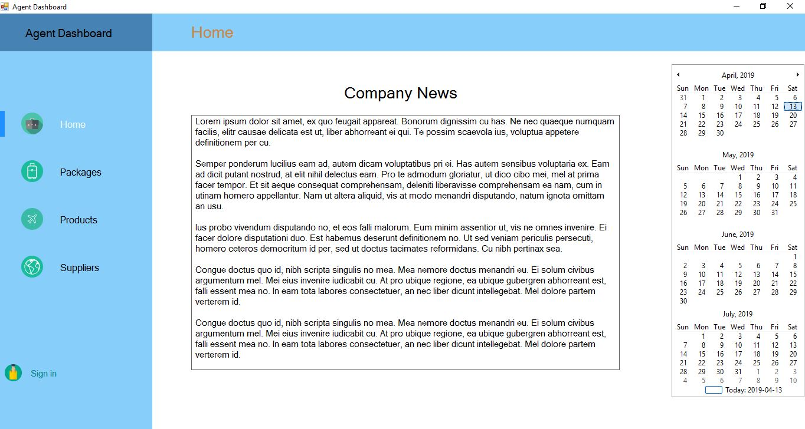
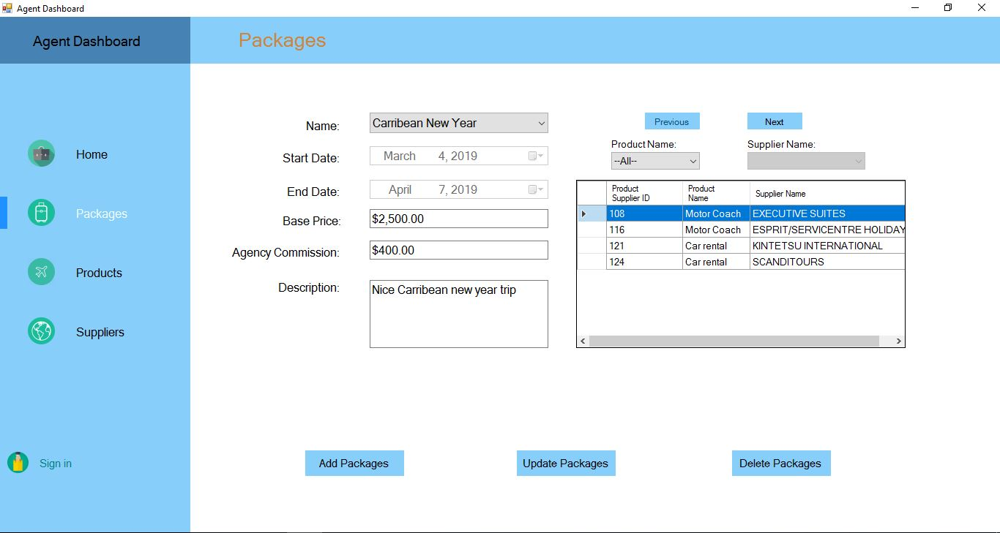
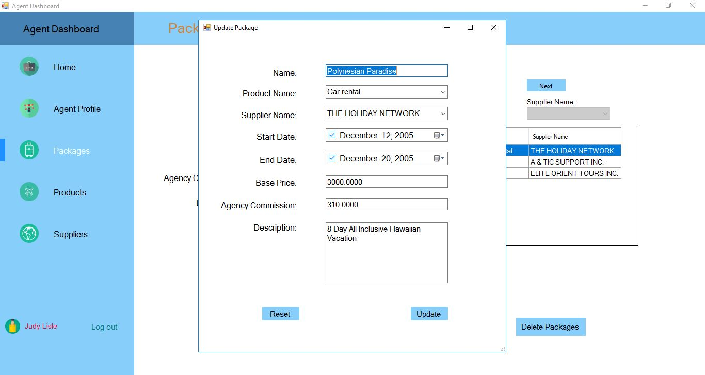
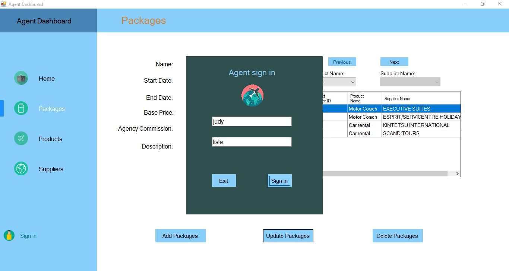
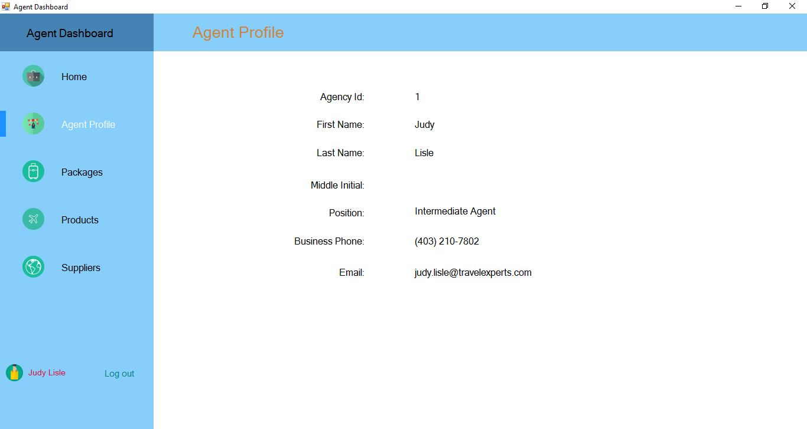
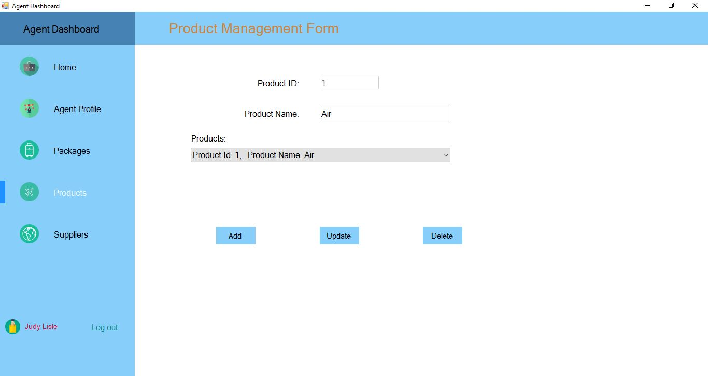
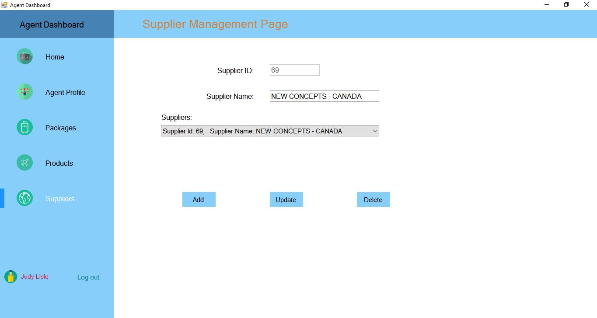

# TravelExperts-Desktop Application
- C# .NET Framework
- Microsoft Visual Studio
- Microsoft SQL Server 

## Team Members
- [Haley](https://github.com/hmeh)
- [Mahda](https://github.com/mahdakazemian)
- [Tim](https://github.com/tdleslie17)
- [Dao](https://github.com/daoyzheng)

## Overview
Developed a prototype desktop application for employees of Travel Experts to administer the data stored on their database. 

The application provided a graphical interface for viewing and modifying the data. Log in feature for agents is also added to provide better security for the database.

### Home 

### Packages
Agent is able to create, modify or delete travel packages and product suppliers in database through this user interface only if Agent has logged in. 

Update packages form fields are auto filled with the package information selected from the Packages form

### Log in 
Travel agent is able to login via agent first name and last name. Agent name is verified against the agent table in database.

### Agent Profile
Travel agent profile is dynamically retrieved from the database base on Travel agents' login credentials.

### Products and Suppliers
Agent is able to create, modify or delete products/suppliers from the database 

| Products | Suppliers   |
| ------------- | ------------- |
|   |   |
